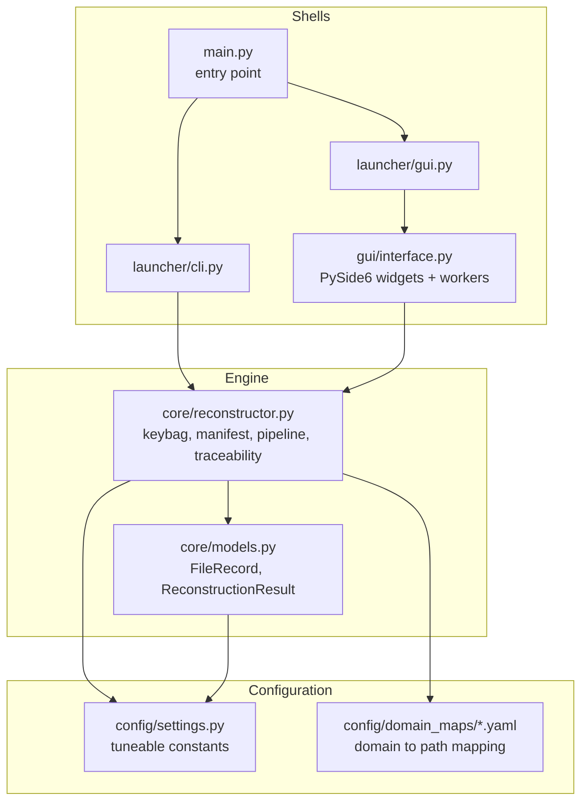
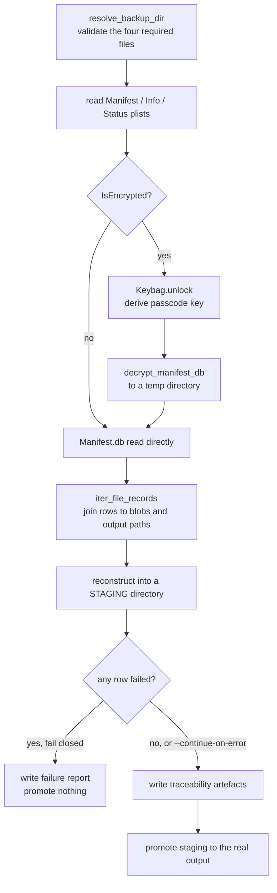

# Architecture

## Layers



Dependencies flow inward. The shells hold no reconstruction logic; the engine
imports no UI code, so it is usable from a CLI, a GUI or a test with equal ease.

## Reconstruction pipeline



### Why staging

Reconstruction writes into a temporary directory beside the destination and
promotes it only once the run has succeeded and the traceability artefacts are
in place. This is what makes "fail closed" real: a failed run leaves no
half-populated output folder that could be mistaken for a complete one.

Because the rows are produced while writing to staging but must describe the
final location, `reconstruct_to_folder` takes a separate `report_root`. Without
it, every `output_path` in the manifest would name a temporary directory that
no longer exists by the time anyone reads it.

## Path safety

Domain and relative-path segments come from the backup and are therefore
untrusted. `sanitise_segment` replaces characters invalid on Windows, prefixes
reserved device names, and strips leading/trailing dots and spaces;
`safe_output_path` and `safe_join_path` drop `..` and absolute segments. Output
paths are always relative to the output root, so a crafted manifest cannot
write outside the folder the operator chose.

`claim_unique_path` then reserves each path, disambiguating genuine collisions
with a `~1` suffix while allowing a directory record to land on a directory
already created as the parent of an earlier file record.

## Module responsibilities

| Module | Responsibility |
| --- | --- |
| `main.py` | Dispatch between GUI and CLI |
| `launcher/cli.py` | CLI entry point |
| `launcher/gui.py` | GUI entry point, PySide6-absent handling |
| `gui/interface.py` | Widgets and background workers; no reconstruction logic |
| `core/reconstructor.py` | Keybag, manifest parsing, mapping, pipeline, traceability, CLI parser |
| `core/models.py` | `FileRecord`, `ReconstructionResult` |
| `config/settings.py` | Operator-tuneable constants |
| `config/domain_maps/` | Shipped domain mappings, loaded via `importlib.resources` |

## Testing

`tests/test_ios_backup_reconstruct.py` builds synthetic backups in temporary
directories — no real evidence data is committed to the repository. The suite
covers both output formats, both layouts, domain-map selection, failure and
`--continue-on-error` behaviour, dry runs, password redaction, and regression
tests for traceability paths, size handling and directory-record collisions.

```bash
uv run python -m unittest discover -s tests
```
