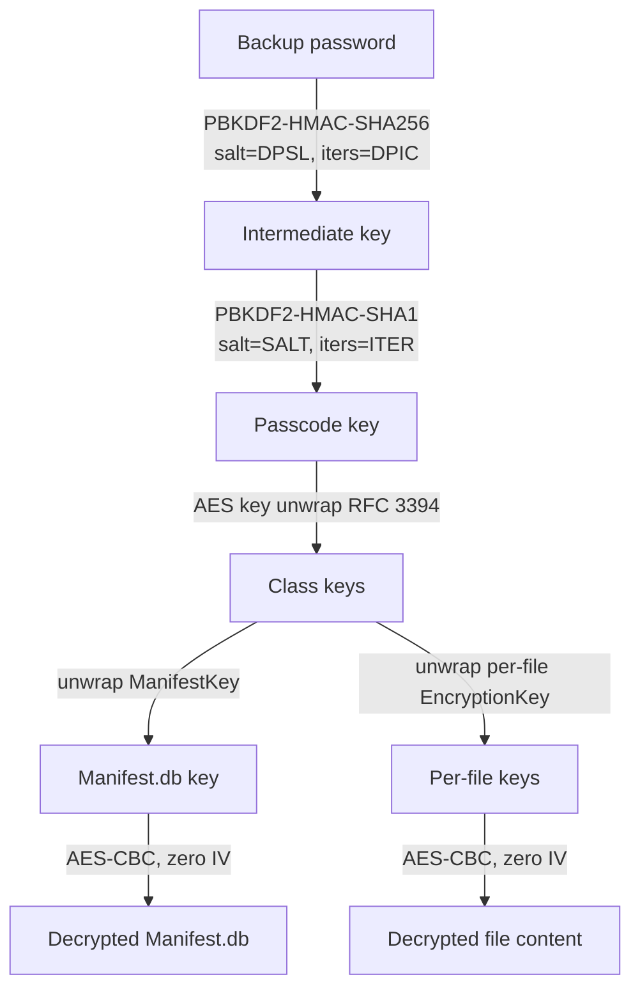

# Encryption

## Where this lives in the code

Each step below is implemented in `core/reconstructor.py`; the names are stable
entry points if you want to read along:

| Step | Implementation |
| --- | --- |
| Parse the keybag TLV blob | `Keybag._parse`, `tlv_blocks` |
| Derive the passcode key | `Keybag.unlock` |
| Unwrap a class key / file key | `Keybag.unwrap_key` |
| Decrypt `Manifest.db` | `decrypt_manifest_db` |
| Decrypt one file, streaming | `decrypt_copy` |
| Strip PKCS#7 padding | `strip_pkcs7_if_present` |
| Choose and try passwords | `prepare_manifest_db` |

## How an encrypted backup is keyed

When a backup is encrypted, `Manifest.plist` sets `IsEncrypted` and carries a
`BackupKeyBag`: a TLV blob holding per-protection-class wrapped keys and the
parameters needed to derive the passcode key.

Unwrapping proceeds in three stages:

Both the manifest and the individual files are AES-CBC with a zero IV. Each
file's metadata carries its own wrapped key and protection class; the class key
unwraps the file key, and the file key decrypts the blob.

## Padding and declared size

Decrypted output is PKCS#7-padded to the AES block size. The authoritative
plaintext length is the `Size` field in the file's metadata, so decrypted
output is trimmed to that length.

This trimming applies **only to decrypted content**. In an unencrypted backup
the stored blob is already the file, so it is copied verbatim and the declared
size is recorded in the file manifest for comparison rather than enforced. (An
earlier version enforced it in both cases, which silently truncated intact
files whose metadata carried a stale or zero `Size`.)

## Passwords

The CLI deliberately does **not** accept a password as an argument, because
shells record arguments in history and other users can read them from the
process table. It prompts securely via `getpass` instead.

### Default passwords are opt-in

Acquisition tools often set a known backup password. Passing
`--try-default-passwords` tries those defaults — `1234`, `12345`, `123456`,
`password`, listed in `config/settings.py` — before prompting.

This is **off by default**. Guessing a password, even from a four-entry list, is
a decision an examiner should make deliberately and be able to account for, not
something a tool does silently. When the flag is used:

- the provenance artefact records `output.try_default_passwords: true`;
- if a default password actually unlocks the backup, that is logged as a
  warning naming the password used.

Without a password, without the flag, and with no terminal to prompt on, the
tool refuses rather than guessing. Prompting is skipped entirely when stdin is
not a TTY, so non-interactive runs fail cleanly instead of crashing.

The GUI takes the password in a masked field, never prompts, and never guesses.

A password is never written to any traceability artefact, and the recorded
command line is redacted before being stored.

## Keychain

`KeychainDomain` items are backed up, but their contents are protected under
class keys that a backup password alone does not always release. The tool
reconstructs the keychain database file; interpreting its protected contents is
out of scope.
